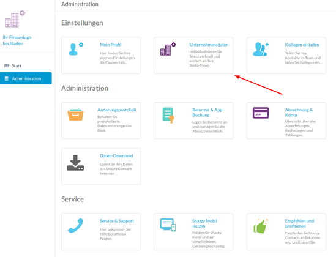
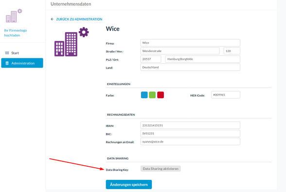

# snazzycontacts-adapter

[Snazzy Contacts](https://snazzycontacts.com) is a smart contact management software for controlling, organizing and managing your contacts data. With [Snazzy Contacts](https://snazzycontacts.com) you could manage your entire team contacts(contacts and organizations) and work flexibly together with your colleagues. You are able to maintain your addresses on all devices from everywhere.

This **adapter** connects [Snazzy Contacts](https://snazzycontacts.com) with third-party applications. With this **adapter** you are able to create different application flows. It supports **"Triggers"** (e.g. ``getPersonsPolling``, ``getOrganizationsPolling``) as well as **"Actions"** (e.g. ``upsertPerson``, ``deleteOrganization``, ``updatePersonsOrganization``, etc.), therefore with this **adapter** you could both read and fetch data from [Snazzy Contacts](https://snazzycontacts.com) and write and save data in [Snazzy Contacts](https://snazzycontacts.com).

## Before you begin

Before you can use the component you **must be a registered snazzy contacts user**. Please visit the home page of [https://snazzycontacts.com](https://snazzycontacts.com) to sign up.
> Any attempt to reach [Snazzy Contacts](https://snazzycontacts.com) endpoints without registration will not be successful

After you are already registered in [Snazzy Contacts](https://snazzycontacts.com) you have to activate your **API Key** (in [Snazzy Contacts](https://snazzycontacts.com) named *Data Sharing Key*).
> For activation you **have to be logged in**, then click of ``Administration`` and under ```Einstellungen``` click of ``Unternehmensdaten``. Once you are in ``Unternehmensdaten`` click of the button ``Data Sharing aktivieren`` for generating your API key.


***


Once the activation is done you have an access to **API Key** which is required for an authentication when you make a request to Snazzy Contacts.

## Actions and triggers
The **adapter** supports the following **actions** and **triggers**:

#### Triggers:
  - Get persons - polling (```getPersonsPolling.js```)
  - Get organizations - polling (```getOrganizationsPolling.js```)
  - Get deleted persons - polling (```getDeletedPersonsPolling.js```)
  - Get deleted organizations - polling (```getDeletedOrganizationsPolling.js```)

  All triggers are of type '*polling'* which means that the **trigger** will be scheduled to execute periodically. It will fetch only these objects from the database that have been modified or created since the previous execution. Then it will emit one message per object that changes or is added since the last polling interval. For this case at the very beginning we just create an empty `snapshot` object. Later on we attach ``lastUpdated`` to it. At the end the entire object should be emitted as the message body.

#### Actions:
  - Upsert person (```upsertPerson.js```)
  - Upsert organization(```upsertOrganization.js```)
  - Delete person (```deletePerson.js```)
  - Delete organization (```deleteOrganization.js```)
  - Update person's organizations (```updatePersonsOrganization.js```)

> **NOTE:** As mentioned before, to perform an action or a call trigger you have to be a registered [Snazzy Contacts](https://snazzycontacts.com) user and you have to pass your **API Key** (in [Snazzy Contacts](https://snazzycontacts.com) named *Data Sharing Key*) when you send a request.

In each trigger and action, before sending a request we create a session in [Snazzy Contacts](https://snazzycontacts.com) via calling the function ```createSession()``` from ```snazzy.js``` file, which is located in directory **utils**. This function returns a cookie which is used when we send a request to
[Snazzy Contacts](https://snazzycontacts.com).

##### Get persons

Get persons trigger (```getPersonsPolling.js```) performs a request which fetch all new and updated persons saved by a user in [Snazzy Contacts](https://snazzycontacts.com).

##### Get organizations

Get organizations trigger (```getOrganizationsPolling.js```) performs a request which fetch all new and updated organizations saved by a user in [Snazzy Contacts](https://snazzycontacts.com).

##### Get deleted persons

Get deleted persons trigger (```getDeletedPersonsPolling.js```) fetches all persons which have recently been deleted.

##### Get deleted organizations

Get deleted organizations trigger (```getDeletedOrganizationsPolling.js```) fetches all organizations which have recently been deleted.

##### Upsert person

Upsert person action (``upsertPerson.js``) updates an existing person if it already exists. Otherwise creates a new one. At this point of time the function accepts as required parameters ``name`` and ``firstname``, but of course you can also pass other parameters like ``email``, ``phone``, ``salutation``, ``title``, etc.

##### Upsert organization

Upsert organization action (``upsertOrganization.js``) updates an existing organization if it already exists. Otherwise creates a new one. This function accepts as required parameter only ``name``, but if you wish you can also pass ``town``, ``street``, ``street_number``, ``zip_code``, ``country``etc.

##### Delete person

Delete person action (``deletePerson.js``) deletes a person in [Snazzy Contacts](https://snazzycontacts.com). The required parameter is ``rowid`` of the person which you want to delete.

>**NOTE**: We do ***NOT*** really delete the person from our database, we just set a value in field ``is_deleted`` to ``1`` which actually ***hides*** the person from the view.

##### Delete organization

Delete organization action (``deleteOrganization.js``) deletes an organization in [Snazzy Contacts](https://snazzycontacts.com). The required parameter is ``rowid`` of the organization which you want to delete.

>**NOTE**: We do ***NOT*** really delete the organization from our database, we just set a value in field ``is_deleted`` to ``1`` which actually ***hides*** the organization from the view.

##### Update person's organizations
Update person's organizations action (```updatePersonsOrganization.js```) assigns one person to one or more organizations. This means that one person could be  assigned to as many organizations as you want. The function accepts as required parameters ``same_contactperson``, ``for_rowid``, ````name```` und ``firstname``.

###### Rrequired parametes:
  - ``same_contactperson`` - that is an ``id`` which is generated when the person was created
  - ``for_rowid`` - that is the ``rowid`` of the organization to which you want to assign the current person
  - ``name`` - you need to pass the same ``name`` as the initial one  
  - ``firstname`` - you need to pass the same ``firstname`` as the initial one

>**IMPORTANT**:  With this action we actually create a duplicate of the person which has the same ``same_contactperson``, that's why you have to pass the same ``name`` and ``firstname`` to prevent misconception

***

## License

Apache-2.0 © [Wice GmbH](https://wice.de/)
