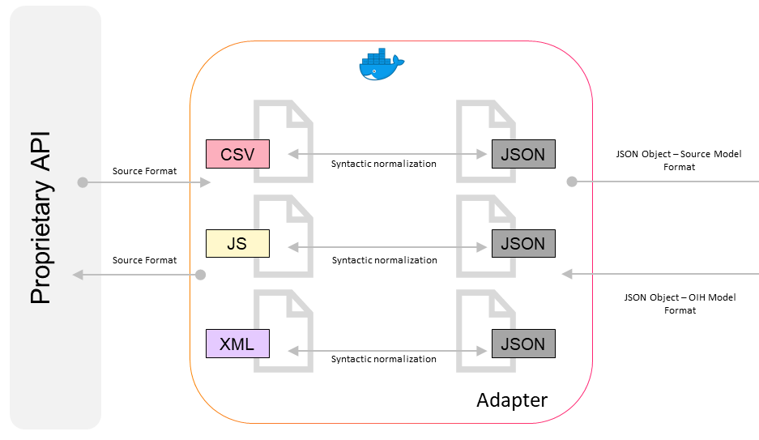

# Adapter

## Table of Contents
- [Getting Started](#getting-started)
- [Adapter Tasks](#adapter-tasks)
    - [Exposes an Endpoint](#exposes-an-endpoint)
    - [Manipulating Data Stored by a System](#manipulating-data-stored-by-a-system)
  
## Adapter Concept

The Adapter is a single, reusable piece of functionality that stands between your solution’s API and the Transformer. To enable communication between you and Open Integration Hub, the Adapter syntactically normalizes and transforms your applications data into a JSON object. For example, transforming CSV-, JS-, XML- files into JSON objects. The Adapter exposes the endpoint of your SaaS solution’s API via pre-defined actions and triggers(see elastic.io's definition of a component.json file[]). Those make sure that the four basic operations of persistent storage are available, such as create, read, update and delete a file.

## Getting Started

1. If you are planning to write your own Adapter while not being familiar with them, the folder  [`GettingStarted`](GettingStarted) is designed to be the starting point.  It explains the concept of the Adapter, how it works, the problems which an Adapter must solve and the recommended way of doing so. This document also includes a decision tree as well, helping you to discover which case your API falls into, respectively, how your Adapter should behave.

2. [`AdapterBehaviorStandardization`](/Adapters/AdapterBehaviorStandardization) will then describe the various actions and triggers in detail, additional functionalities that an Adapter can perform and the standard way of exposing those. 

3. For actual implementations of Adapters, please checkout our examples for [`SnazzyContacts`](/Examples/SnazzyContactsAdapter) and [`Wice`](/Examples/WiceAdapter)!

4. Once you have finished creating an Adapter there is a file called [`AdapterFunctionalityChecklist`](/AdapterChecklists/AdapterFunctionalityChecklist.md) which helps you to document all functionalities of your Adapter and therefore  make it more comprehensible for third parties.

5. In order to test your component, different resources must be provided. These resources are listed within the [`RequirementsToTestOrBuildAnAdapter`](/AdapterChecklists/RequirementsToTestOrBuildAnAdapter.md) file.

## Adapter Tasks

There are two ways in which an adapter can expose the API functionality:

### Exposes an Endpoint

In this approach, the API exposes an endpoint and the adaptor provides actions
as a way to call that endpoint from a flow.  For example, [Mandrill's API
contains the Send Message API
endpoint](https://mandrillapp.com/api/docs/messages.JSON.html#method=send).
This endpoint expects parameters related to email sending and tracking to be
provided to the endpoint.  An adapter exposes this functionality by allowing the
values for all of these parameters to be configured by an integrator.  In this
case, the adapter is responsible for the following:

- Knowing/building the URL to which the request is provided
- Handling any authentication required by the request
- Exposing all inputs to the integration platform
- Carrying out the request, provide the results of the request back to the platform and handling any errors that occur in the process

### Manipulating Data Stored by a System

In this approach, the external system is a system which stores data that can be
read and manipulated through an API.  The adapter, instead of providing explicit
access to API mechanisms, provides actions and triggers which facilitate the
reading and manipulation of the underlying data.  For instance, consider
[Salesforce's REST
API](https://developer.salesforce.com/docs/atlas.en-us.api_rest.meta/api_rest/resources_list.htm).
This API exposes many endpoints where the purpose of most of the endpoints is to
read and manipulate data in Salesforce.  While it is possible to expose these
endpoints using method 1, doing so is generally not useful as it requires the
integrator to have a deep understanding of the mechanisms specific to this API.
Therefore, the adapter should encapsulate/abstract away the mechanics of the API
by making actions and triggers available to the integrator so that the
integrator can manipulate data.  This is in addition to all of the
responsibilities of approach 1.
*Note: Within any given adapter, it is possible to combine the two approaches if
doing so makes sense.*
