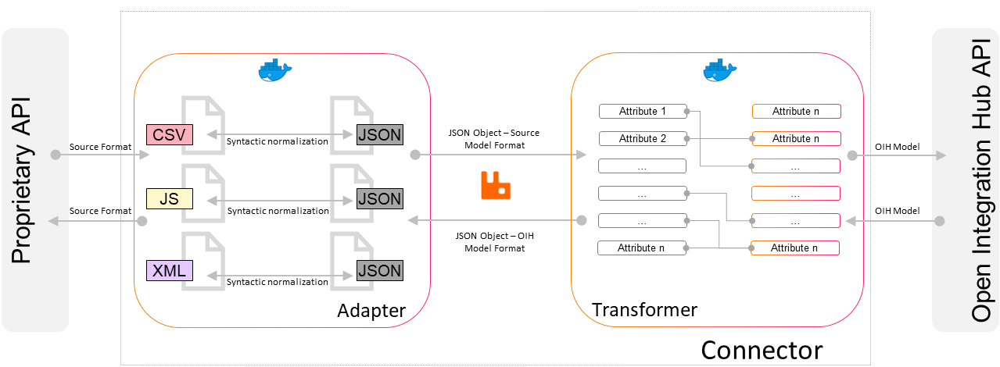

  

The revolution in data synchronization — the Open Integration Hub enables simple data synchronization between any software applications and thus accelerates digitalisation

Visit the official [Open Integration Hub homepage](https://www.openintegrationhub.org/)

# Connector

## Table of Content

<!-- TOC depthFrom:2 depthTo:6 withLinks:1 updateOnSave:1 orderedList:0 -->

- [Table of Content](#table-of-content)
- [Introduction](#introduction)
	- [Adapter](#adapter)
	- [Transformer](#transformer)
- [Contribution](#contribution)
	- [Contribution Guidelines](#contribution-guidelines)
	- [Code of Conduct](#code-of-conduct)
- [Contact](#contact)
- [Content](#content)
	- [Folders](#folders)
	- [Documents](#documents)
- [Workgroup](#workgroup)
	- [Information](#information)
	- [Member](#member)
- [Wording](#wording)

<!-- /TOC -->

## Introduction

The Open Integration Hub enables data synchronization across a variety of applications. To create a connection and enable interaction a link is needed between the software application and the Open Integration Hub - namely an Open Integration Hub connector.
A connector connects a software solution to the Open Integration Hub. It consists of two distinct parts, namely adapter and transformer.  It contains different functionalities e.g. to fetch and transform data. These functionalities are further explained in the sections [adapter](#adapter) and [transformer](#transformer). In order to achieve our goal to establish a successful open source community we need to steadily increase the number of connectors. So join us and help us grow as an open source community!

The following illustration provides a holistic overview of a connector:

### Adapter

An adapter is a module for the syntactic connection of an external application and its data to the Open Integration Hub. This includes protocol translation, data format transformation, etc.
Furthermore it provides functionalities to perform e.g. CRUD operations within the source system.

For further information please read through the information within the [adapter folder](/Adapters).

### Transformer

A transformer is responsible to semantically transform an incoming JSON object into another JSON object. Thus the mapping between two data models is done within the transformer.

For further information please read through the information within the [transformer folder](/Transformer).

## Contribution
### Contribution Guidelines
Before you contribute please read our [contribution guidelines](CONTRIBUTING.md).

### Code of Conduct

To see how members of the community are expected to behave, please read the [code of conduct](CODE_OF_CONDUCT.md). We apply the code of conduct defined by the Contributor Covenant, which is used across many open source projects, such as [NodeJS](https://github.com/nodejs/node), [Atom](https://github.com/atom/atom) and [Kubernetes](https://github.com/kubernetes/kubernetes).

## Contact
When looking for further information or support, please contact: philipp.hoegner@cloudecosystem.org.

## Content
### Folders

- [Adapters](Adapters): Describes the adapters, their goals, standardized behavior and checklists for building an adapter
- [ApplicationDocuments](ApplicationDocuments): Contains all application documents needed to apply for the funding of the creation of a connector
- [Protocols](Protocols): Collection of all taken protocols by the workgroup
- [Transformer](Transformer): Includes the transformer concept, a basic introduction into the JSONata transformation language,  transformer evolution and suggestions for possible implementations

### Documents
- [CONTRIBUTING](CONTRIBUTING.md): Contains the contribution guideline for the Open Integration Hub project
- [CODE_OF_CONDUCT](CODE_OF_CONDUCT.md): Contains an explanation of the expected behavior of the community members, following  the code of conduct defined by the Contributor Covenant

## Workgroup
### Information
You have the opportunity to get your questions answered in a `weekly Q&A session`.
Feel free to attend and invite other people to this session.

If possible please send your question in advance to **philipp.hoegner@cloudecosystem.org**.

The session will take place every `Monday from 11:00 - 12:00`.  The first session will be next monday.

**GoToMeeting Link:** https://global.gotomeeting.com/join/456709357  
**Phone (Germany):** +49 692 5736 7317  
**Access-Code (Germany):** 456-709-357  

### Member
#### Connectors
|Member Name |GitHub Alias|Company| Role |
| --- | --- | --- | --- |
| Selim Achmerzaev |[sachmerz](https://github.com/sachmerz)|[Basaas](http://www.basaas.com/)| Committer  |
| Igor Drobiazko |[drobiazko](https://github.com/drobiazko)|[Elastic.io](http://www.elastic.io/)| Committer  |
| Franz  Degenhardt|[FranzDegenhardt](https://github.com/FranzDegenhardt)|[X-Integrate](https://x-integrate.com/x-integrate-startseite/)| Committer  |
| Hansjörg Schmidt  |[hschmidthh](https://github.com/hschmidthh)|[Wice](https://wice.de/)| Committer  |
| Philipp Hoegner|[philecs](https://github.com/philecs)|[Cloud Ecosystem](http://www.cloudecosystem.org/)| Committer  |

## Wording
Within the project different terms and abbreviations are frequently used. All terms and abbrevations are explained within the [glossary](https://github.com/openintegrationhub/Connectors/wiki/Glossary) and our [list of abbrevations](https://github.com/openintegrationhub/Connectors/wiki/Abbreviations).
