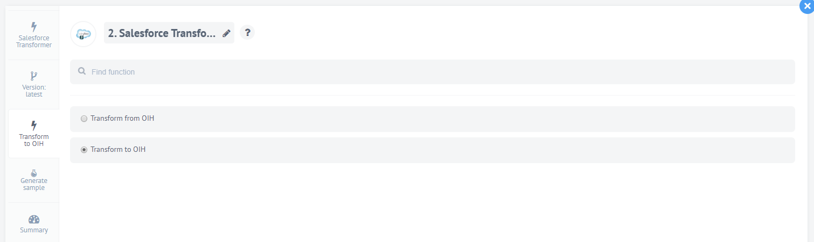

# SalesforceTransformer [![NPM version][npm-image]][npm-url] [![Build Status][travis-image]][travis-url] [![Dependency Status][daviddm-image]][daviddm-url]

## Authentication

This component requires no authentication.


## Source Application
> Dedicated [Salesforce](https://www.salesforce.com) transformer for elastic.io platform based on JSONata.

## Relating Adapter
This transformer interacts and transforms the incoming input of the Open Integration Hub and the [Salesforce adapter (component)](https://github.com/elasticio/salesforce-component)

Currently only one version of the Salesforce adapter is available.

## Relating Master Data Model
All currently existing actions refer to the [Master Data Model Addresses V2](https://github.com/openintegrationhub/Data-and-Domain-Models/tree/master/MasterDataModels/Addresses)

## Covered Domain Objects
Currently, the followowing domain objects are covered:

- Contacts
- Tasks

## Actions
Currently, the followowing actions are available:

- transformContactToOih
- transformContactFromOih
- transformTaskToOih
- transformTaskFromOih

## How it works

The component supports two actions - **Transform to OIH** and **Transform from OIH**. This means that the component takes the incoming message body from the previous step and creates a new expression in a ``JSON`` format. The new generated ``JSON`` object has specific properties which represent the input/output for the next/previous component in the flow.
The uses a fact that JSONata expression is a superset of JSON document so that by default any valid JSON document is a valid JSONata expression.

**Actions** in the elastic.io graphical interface:



Let's see how the action **Transform from OIH** works.

```js
{
  "OtherStreet": jsonata(`$lookup($filter(${msg.body.addresses}, function($v) { ${$v.description} = "other"}), "street")`).evaluate(),
  "OtherCity": jsonata(`$lookup($filter(msg.body.addresses, function($v) { ${$v.description} = "other"}), "city")`).evaluate(),
  "OtherState": jsonata(`$lookup($filter(msg.body.addresses, function($v) { ${$v.description} = "other"}), "region")`).evaluate()
}
```

The result of that transformation will be the following JSON document:

```json
{
  "OtherStreet": "5th avenue",
  "OtherCity": "new york city",
  "OtherState": "new york"
}
```

The action **Transform to OIH** works the same way. Let's take this incoming message body from [Snazzy Contacts](https://snazzycontacts.com) component:

```js
{
  "gender": "",
  "salutation": msg.body.salutation,
  "firstName": msg.body.FirstName,
  "lastName": msg.body.LastName
}
```

The result of that transofrmation will be the following JSON document:

```json
{
    "gender": "",
    "salutation": "Mr.",
    "firstName": "John",
    "lastName": "Doe"
}
```

## Version

Version 1.0.0

## License

Apache-2.0 © [elastic.io GmbH](http://elastic.io)

[npm-image]: https://badge.fury.io/js/jsonata-transform-component.svg
[npm-url]: https://npmjs.org/package/jsonata-transform-component
[travis-image]: https://travis-ci.org/elasticio/jsonata-transform-component.svg?branch=master
[travis-url]: https://travis-ci.org/elasticio/jsonata-transform-component
[daviddm-image]: https://david-dm.org/elasticio/jsonata-transform-component.svg?theme=shields.io
[daviddm-url]: https://david-dm.org/elasticio/jsonata-transform-component
