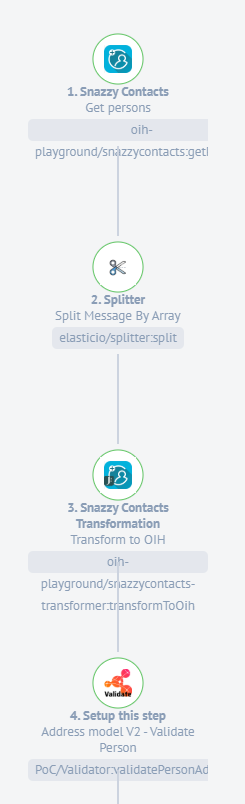
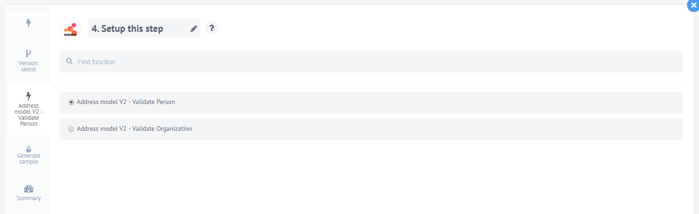
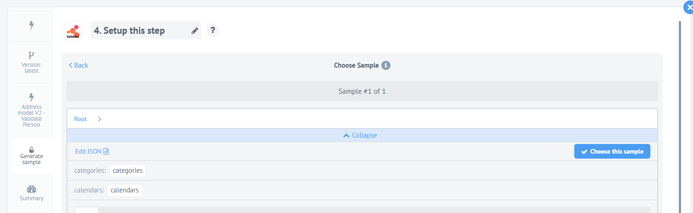
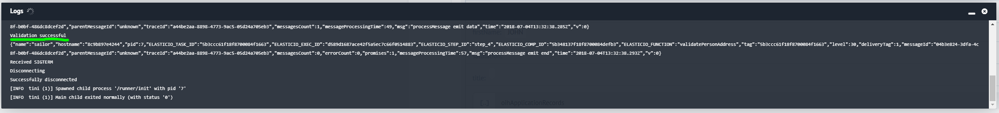
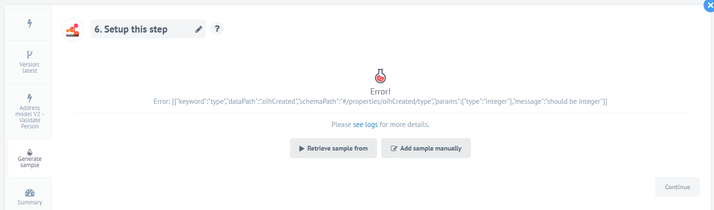

  

The revolution in data synchronization — the Open Integration Hub enables simple data synchronization between any software applications and thus accelerates digitalisation

Visit the official [Open Integration Hub homepage](https://www.openintegrationhub.de/)

## Table of Content
<!-- TOC depthFrom:2 depthTo:6 withLinks:1 updateOnSave:1 orderedList:0 -->

- [Table of Content](#table-of-content)
- [How it works](#how-it-works)
- [Configuration](#configuration)
	- [Select Validator](#select-validator)
- [Choose Action](#choose-action)
- [Possible Outputs](#possible-outputs)

<!-- /TOC -->

## How it works

The validator validates a given JSON object against a deposited JSON schema. The main purpose of this component is to validate the correctness of the output of the transformer. The typical scenario in which the validator is used is: `Adapter` --> `Transformer` --> `Validator`. This means, the data from the application is transferred via the adapter and is afterwars transferred to the transformer where the data is semantically mapped. To ensure the correctnes of the mapping the validator follows right after the transformer and either respons with a success or error message.

Exemplary flow: 

## Configuration

### Select Validator

After you successfully created the subsequent steps you need to select the Validator component:

## Choose Action

Based on the type of object you select you need to select the relating action within the validator to validate the object against the correct schema:

## Possible Outputs

`Valid JSON object:` Validation successful & Sample was retrieved from validator

 
 

`Invalid JSON object:` Error message that includes the specific error

